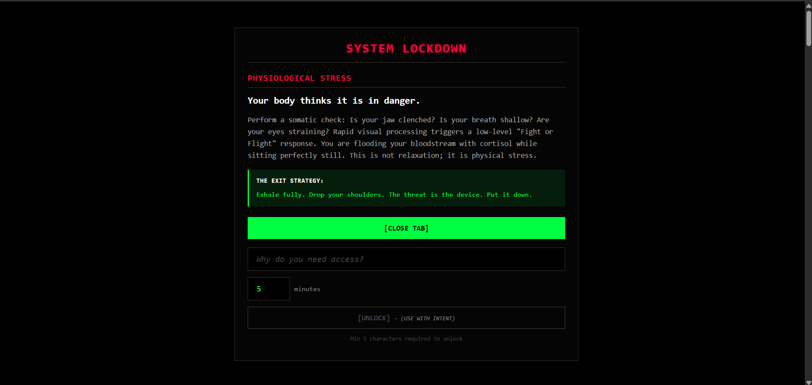
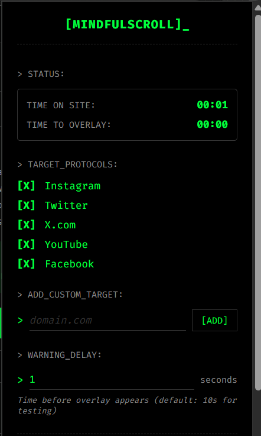

# MindfulScroll

A Chrome Extension that helps you break free from doomscrolling by interrupting your browsing with mindful reminders and requiring conscious intent to continue.


MindfulScroll is a Chrome extension that interrupts doomscrolling using  
**neuroscience-based warnings** + **intent-based unlocking** + a  
**hacker/terminal-inspired SYSTEM LOCKDOWN screen**.

Instead of blocking sites blindly, MindfulScroll forces you to stop, think,  
state your intention, and use the internet **consciously instead of compulsively**.

## 🎯 Overview

MindfulScroll is designed to combat infinite scrolling and promote mindful internet usage. After a configurable time period on social media sites, the extension displays a full-screen overlay with psychological insights about your scrolling behavior. To continue browsing, you must state your intent and specify how much additional time you need.

## ✨ Features

- **Smart Site Tracking** - Automatically tracks time spent on social media sites
- **Configurable Timer** - Set your own warning delay (default: 10 seconds for testing, 5 minutes for production)
- **Intent-Based Unlock** - Requires you to consciously state why you need to continue
- **10 Psychological Warnings** - Random messages explaining the impact of doomscrolling
- **Terminal Aesthetic** - Hacker/terminal-themed UI with monospace fonts
- **Real-Time Timer** - See your time spent and time remaining in the extension popup
- **Custom Site Management** - Add or remove sites from the block list
- **Non-Intrusive Display** - Compact timer overlay that doesn't block content

## 📸 Screenshots

### 🔒 Overlay (SYSTEM LOCKDOWN)



### 🧭 Popup Dashboard



## 🚀 Installation

### From Source

1. Clone this repository:
   ```bash
   git clone https://github.com/binaryzen7/MindfulScroll.git
   cd MindfulScroll
   ```

2. Open Chrome and navigate to `chrome://extensions/`

3. Enable "Developer mode" (toggle in top-right corner)

4. Click "Load unpacked"

5. Select the `MindfulScroll` directory

6. The extension icon should appear in your Chrome toolbar

## 📖 Usage

### Initial Setup

1. Click the MindfulScroll icon in your Chrome toolbar
2. Configure your settings:
   - Select which sites to block (default: Instagram, Twitter, X.com, YouTube, Facebook)
   - Set your warning delay (how long before overlay appears)
   - Add custom sites if needed
3. Click `[SAVE SYSTEM]` to save your preferences

### How It Works

1. **Tracking Phase**: When you visit a blocked site, a timer starts counting down
2. **Lockdown Phase**: After the timer expires, a full-screen overlay appears with a random warning message
3. **Unlock Phase**: 
   - Click `[CLOSE TAB]` to exit (recommended)
   - OR type your intent (minimum 5 characters) and specify time needed
   - Click `[UNLOCK]` to continue browsing
4. **Intent Timer**: A small timer appears in the top-left showing your intent and remaining time
5. **Loop**: When your unlock time expires, the overlay reappears

### Extension Popup

- **Status Section**: Shows time spent and time until overlay (only visible on blocked sites)
- **Target Protocols**: Manage which sites are blocked
- **Warning Delay**: Configure how long before overlay appears
- **Save System**: Save all your settings

## 🎨 Design

MindfulScroll features a **hacker/terminal aesthetic**:
- Pure black backgrounds (#000000)
- Matrix green accents (#00ff41)
- Monospace fonts (Fira Code, JetBrains Mono, Consolas)
- Minimal borders and no shadows
- Terminal-style UI elements

## 📁 Project Structure

```
MindfulScroll/
├── manifest.json              # Extension configuration
├── background.js              # Service worker (default settings)
├── content.js                 # Main logic (tracking, overlay, timer)
├── popup.html                 # Settings interface
├── popup.js                   # Settings logic
├── popup.css                  # Popup styling (terminal theme)
├── styles.css                 # In-page styles (overlay, timer)
├── README.md                  # This file
├── CONTRIBUTING.md            # Contribution guidelines
├── LICENSE                    # License file
├── CHANGELOG.md               # Version history
└── PRODUCT_SPECIFICATION.md   # Detailed product specs
```

## ⚙️ Configuration

### Default Blocked Sites
- Instagram (instagram.com)
- Twitter (twitter.com)
- X.com (x.com)
- YouTube (youtube.com)
- Facebook (facebook.com)

### Warning Delay
- **Testing**: 10 seconds (default)
- **Production**: 5 minutes (300 seconds)
- **Range**: 1-60 seconds (configurable)

### Unlock Duration
- **Default**: 5 minutes
- **Range**: 1-60 minutes
- Set per unlock request

## 🛠️ Development

### Prerequisites
- Chrome browser (latest version)
- Basic knowledge of JavaScript, HTML, CSS
- Chrome Extensions API knowledge

### Building
No build process required - the extension runs directly from source files.

### Testing
1. Load the extension in developer mode
2. Visit a blocked site (e.g., instagram.com)
3. Wait for the overlay to appear (default: 10 seconds)
4. Test unlock functionality
5. Check popup timer display

## 📝 License

This project is licensed under the MIT License - see the [LICENSE](LICENSE) file for details.

## 🤝 Contributing

Contributions are welcome! Please read our [CONTRIBUTING.md](CONTRIBUTING.md) file for guidelines on how to contribute.

## 📄 Documentation

- [Product Specification](PRODUCT_SPECIFICATION.md) - Detailed feature documentation
- [Changelog](CHANGELOG.md) - Version history and changes

## 🐛 Known Issues

- Timer may reset on some SPA (Single Page Application) navigations
- Popup timer may not update if content script hasn't loaded

## 🔮 Future Enhancements

- Daily/weekly time limits
- Statistics and analytics dashboard
- Custom warning messages
- Multiple unlock duration presets
- Pause/resume functionality
- Export/import settings
- Whitelist specific pages
- Schedule-based blocking

## 💡 Philosophy

MindfulScroll is built on the principle of **friction over force**. Instead of completely blocking access, it creates moments of pause that require conscious decision-making. The psychological warnings are designed to help users understand the impact of their scrolling habits, not to shame or judge.

## 🙏 Acknowledgments

Inspired by the need to combat digital addiction and promote mindful technology use.

## 📧 Support

For issues, feature requests, or questions:
- Open an issue on GitHub
- Check existing issues for solutions
- Review the [Product Specification](PRODUCT_SPECIFICATION.md) for detailed documentation

---

**Remember**: The goal isn't to eliminate social media, but to use it with intention and awareness. Stay mindful. Stay focused.

